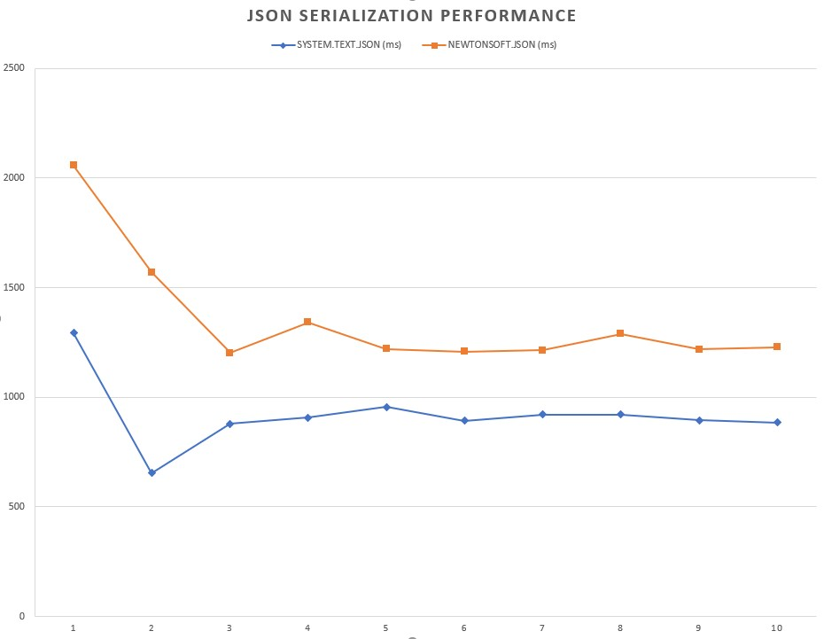

<div align="center">
  <h1>YAMI AN NEPHILIM LIBRARY (YANLib)</h1>
  
  
  
  
  <br>
  
  <br><br>
  <p>A comprehensive .NET utility library providing powerful extension methods for enhanced developer productivity</p>
</div>


## 📋 Table of Contents

- [Installation](#-installation)
- [Overview](#-overview)
- [Key Components](#-key-components)
  - [YANUnmanaged](#yanunmanaged)
  - [YANRandom](#yanrandom)
  - [YANTask](#yantask)
  - [YANText](#yantext)
  - [YANObject](#yanobject)
  - [YANProcess](#yanprocess)
  - [YANJson](#yanjson)
  - [YANMath](#yanmath)
  - [YANDateTime](#yandatetime)
  - [YANExpression](#yanexpression)
- [Performance Benchmarks](#-performance-benchmarks)
- [Code Examples](#-code-examples)
- [Project Architecture](#-project-architecture)
- [License](#-license)


## 📥 Installation

### Package Manager
```
PM> NuGet\Install-Package Tynab.YANLib
```

### .NET CLI
```
dotnet add package Tynab.YANLib
```

### Package Reference
```xml
<PackageReference Include="Tynab.YANLib" Version="x.x.x" />
```


## 📚 Overview

YANLib offers a collection of specialized components, each focusing on a specific area of functionality. The library is designed with a consistent API, robust error handling, and support for both nullable and non-nullable types. All components are implemented as extension methods, allowing for a fluent and intuitive coding experience.

### Common Features Across All Components

- **Extension Methods**: Implemented as extension methods for a fluent API
- **Null Safety**: Robust handling of null values to prevent NullReferenceExceptions
- **Collection Support**: Methods for both single values and collections
- **Generic Type Support**: Flexible type parameters for input and output types
- **Consistent API**: Similar method naming and behavior across components
- **Performance Optimization**: Efficient implementations with caching where appropriate


## 🧩 Key Components

### YANUnmanaged

Provides utilities for parsing and converting unmanaged types with built-in error handling and format support.

#### Key Features

- Object parsing with default value fallbacks
- Nullable type parsing with null for invalid inputs
- Collection parsing with robust error handling
- Format support for date/time and culture-specific parsing

```csharp
// Parse string to int with default value
object input = "123";
int result = input.Parse<int>(); // Returns 123

// Handle invalid input with default value
object invalidInput = "not a number";
int resultWithDefault = invalidInput.Parse<int>(42); // Returns 42

// Parse collection of objects to typed collection
var inputs = new object[] { "123", "456", "789" };
IEnumerable<int> results = inputs.Parses<int>(); // Returns [123, 456, 789]
```

### YANRandom

Offers tools for generating random values of various types, with support for ranges, collections, and nullable types.

#### Key Features

- Random value generation for various types
- Random collection generation
- Support for nullable types
- Support for various numeric types
- Parallel processing for large collections

```csharp
// Generate random values using static methods
int randomInt = YANRandom.GenerateRandom<int>();
double randomDouble = YANRandom.GenerateRandom<double>(-100.5, 100.5);
DateTime randomDate = YANRandom.GenerateRandom<DateTime>();
string randomString = YANRandom.GenerateRandom<string>();

// Generate a collection of random integers
IEnumerable<int> randomInts = YANRandom.GenerateRandoms<int>(size: 10);

// Using Random extensions
var random = new Random();
int randomInt = random.NextInt(-100, 100);
DateTime randomDate = random.NextDateTime();
bool randomBool = random.NextBool();
```

### YANTask

Extends the standard .NET Task API with additional methods for task coordination and management.

#### Key Features

- Conditional task waiting
- Conditional task completion
- Graceful error handling
- Cancellation support

```csharp
// Wait for any task that returns a value greater than 10
var tasks = new[]
{
    Task.FromResult(5),
    Task.FromResult(15),
    Task.FromResult(25)
};

// Returns 15 (the first value that satisfies the condition)
var result = await tasks.WaitAnyWithCondition(x => x > 10);

// Similar functionality with WhenAny pattern
var result2 = await tasks.WhenAnyWithCondition(x => x > 20); // Returns 25
```

### YANText

Provides a comprehensive set of extension methods for text manipulation, validation, and transformation.

#### Key Features

- String manipulation (case conversion, whitespace handling)
- String validation with null safety
- Character operations
- Collection text operations
- Nullable character support

```csharp
// Title case conversion
"hello world".Title(); // Returns "Hello World"

// Capitalize first letter only
"hello world".Capitalize(); // Returns "Hello world"

// Clean whitespace and format names
"  hello  world  ".CleanSpace(); // Returns "hello world"
"john.doe".FormatName(); // Returns "John Doe"

// Filter characters
"abc123!@#".FilterAlphabetic(); // Returns "abc"
"abc123!@#".FilterNumber(); // Returns "123"
"abc123!@#".FilterAlphanumeric(); // Returns "abc123"
```

### YANObject

Offers utilities for object manipulation, validation, and analysis.

#### Key Features

- Null and default value checking
- Property analysis
- Collection operations
- Object manipulation (deep copy, time zone conversion)

```csharp
// Null checking
bool isNull = someObject.IsNull();       // Returns true if object is null
bool isNotNull = someObject.IsNotNull(); // Returns true if object is not null

// Default value checking
bool isDefault = someValue.IsDefault();       // Returns true if value equals default(T)
bool isNotDefault = someValue.IsNotDefault(); // Returns true if value doesn't equal default(T)

// Property analysis
bool allDefault = myObject.AllPropertiesDefault();
bool anyNonDefault = myObject.AnyPropertiesNotDefault();

// Create a deep copy of an object
MyClass copy = myObject.Copy();
```

### YANProcess

Provides utilities for process management and manipulation.

#### Key Features

- Process termination by name
- Robust error handling for edge cases

```csharp
// Kill all processes with a specific name
await "notepad".KillAllProcessesByName();

// Kill multiple processes by their names
await YANProcess.KillAllProcessesByNames("chrome", "firefox", "edge");

// Kill processes from a collection of names
List<string> processesToKill = ["notepad", "calc", "mspaint"];

await processesToKill.KillAllProcessesByNames();
```

### YANJson

Offers JSON serialization and deserialization utilities with robust error handling and performance optimizations.

#### Key Features

- Simple object serialization/deserialization
- Collection processing
- Customization options
- Robust null handling

```csharp
// Serialize an object to a JSON string
string json = myObject.Serialize();

// Deserialize a JSON string to an object
MyClass obj = jsonString.Deserialize<MyClass>();

// Batch process collections
IEnumerable<string> jsonStrings = myObjects.Serializes();
IEnumerable<MyClass> objects = jsonStrings.Deserializes<MyClass>();
```

### YANMath

Provides mathematical operations and functions with robust null handling and type conversion.

#### Key Features

- Basic mathematical operations
- Rounding functions
- Power and root functions
- Trigonometric functions
- Logarithmic and exponential functions

```csharp
// Find the minimum and maximum values
int min = YANMath.Min(10, 5, 8, 3, 7);       // Returns 3
int max = YANMath.Max(10, 5, 8, 3, 7);       // Returns 10

// Calculate average and sum
double avg = YANMath.Average<double>(10, 20, 30, 40);  // Returns 25.0
int sum = YANMath.Sum(10, 20, 30, 40);       // Returns 100

// Rounding operations
double rounded = 3.14159.Round<double>(2);   // Returns 3.14

// Power functions
double sqrt = 16.0.Sqrt<double>();           // Returns 4.0
double pow = 2.0.Pow<double>(3);             // Returns 8.0
```

### YANDateTime

Offers DateTime manipulation and calculation functionality with support for various data types and collections.

#### Key Features

- Time zone conversion
- Week of year calculation
- Month difference calculation
- Support for nullable DateTime
- Collection processing

```csharp
// Convert a DateTime from one time zone to another
DateTime utcDate = new DateTime(2023, 6, 15, 10, 0, 0);
DateTime convertedDate = utcDate.ChangeTimeZone(0, 3); // UTC to UTC+3

// Get week number for a date
DateTime date = new DateTime(2023, 6, 15);
int weekNumber = date.GetWeekOfYear(); // Returns 24

// Calculate months between dates
int monthDiff = YANDateTime.TotalMonth(new DateTime(2023, 6, 15), new DateTime(2022, 6, 15)); // Returns 12
```

### YANExpression

Provides utilities for working with expression trees and dynamic property access in C#.

#### Key Features

- Dynamic property access
- Lambda creation
- Expression caching for performance

```csharp
// Create an expression that accesses the "Name" property of TestClass
var expression = YANExpression.PropertyExpression<TestClass>("p", "Name");

// Compile and use the expression
var func = expression.Compile();
var result = func(myTestClassInstance);
```


## 📊 Performance Benchmarks

YANLib is designed with performance in mind. The library uses various optimizations to ensure high performance:

- Caching of expressions and reflection results
- Efficient memory usage with custom pooling
- Parallel processing for large collections where appropriate
- Optimized algorithms for common operations

### JSON Performance

YANJson is built on System.Text.Json, which offers significantly better performance compared to Newtonsoft.Json, especially for large datasets.

<div align="center">
  
</div>

System.Text.Json is designed to provide better performance and security compared to other JSON libraries. It supports advanced features like parallel parsing and support for new data types such as Span and Utf8JsonReader, enabling faster data processing and reduced memory usage.

Based on performance benchmark tests conducted in different environments and scenarios, System.Text.Json is generally considered to have the best performance among these libraries. According to performance tests, the results show that System.Text.Json has significantly faster JSON-to-.NET object and vice versa conversion times compared to Newtonsoft.Json, especially in cases with large data.

#### Case Sensitivity and Configuration

When the properties of the object to be serialized to JSON have different capitalization, exceptions can occur when using JSON libraries. YANJson handles property case sensitivity issues elegantly while maintaining high performance.

To address case sensitivity issues, standard approaches include:

1. Configure `JsonSerializerOptions.PropertyNameCaseInsensitive` to ensure that the Deserialize process can find properties regardless of their capitalization
2. Use `JsonSerializerOptions.IgnoreNullValues` to exclude properties with null values during serialization
3. Use `JsonSerializerOptions.WriteIndented` to configure the formatting of the serialized result
4. Use `JsonSerializerOptions.MaxDepth` to limit the maximum depth of the object being serialized or deserialized
5. Use `JsonSerializerOptions.DictionaryKeyPolicy` to configure the naming of keys in a Dictionary

However, using these options can affect performance. YANJson provides optimized methods that maintain high performance while handling case sensitivity appropriately.

For the most recent performance benchmarks, visit:
[https://yanlib.yamiannephilim.com/api/json/yan-vs-standards?quantity=10000&hideSystem=true](https://yanlib.yamiannephilim.com/api/json/yan-vs-standards?quantity=10000&hideSystem=true)

<div align="center">
  
</div>

## 💻 Code Examples

### Data Processing Pipeline

```csharp
public List<Product> ProcessProductData(string[] rawData)
{
    return rawData
        .Where(line => line.IsNotNullWhiteSpace())
        .Select(line => line.Split(','))
        .Select(parts => new Product
        {
            Id = parts[0].Parse<int>(),
            Name = parts[1].CleanSpace().Capitalize(),
            Price = parts[2].Parse<decimal>(),
            IsAvailable = parts[3].Parse<bool>()
        })
        .Where(p => p.Id > 0 && p.Name.IsNotNullEmpty())
        .ToList();
}
```

### Asynchronous Operations with Error Handling

```csharp
public async Task<WeatherData> GetWeatherFromMultipleProviders(string location)
{
    var providers = new[]
    {
        GetWeatherFromProvider1(location),
        GetWeatherFromProvider2(location),
        GetWeatherFromProvider3(location)
    };

    // Return the first non-null weather data
    return await providers.WaitAnyWithCondition(data => data != null);
}
```

### Object Validation and Transformation

```csharp
public bool IsValidCustomer(Customer customer)
{
    // Customer must not be null and must have all required properties set
    return customer.IsNotNull() && 
           !customer.AnyPropertiesDefault(["Name", "Email", "PhoneNumber"]);
}

public Customer PrepareCustomerData(Customer customer)
{
    // Create a copy and normalize the data
    var normalizedCustomer = customer.Copy();

    normalizedCustomer.Name = normalizedCustomer.Name.CleanSpace().FormatName();
    normalizedCustomer.Email = normalizedCustomer.Email.Lower();
    normalizedCustomer.PhoneNumber = normalizedCustomer.PhoneNumber.FilterNumber();
    
    return normalizedCustomer;
}
```

### Random Test Data Generation

```csharp
public class TestDataGenerator
{
    public List<User> GenerateUsers(int count)
    {
        return YANRandom.GenerateRandoms<int>(size: count)
            .Select(i => new User
            {
                Id = i,
                Name = YANRandom.GenerateRandom<string>(),
                Age = YANRandom.GenerateRandom<int>(18, 80),
                RegistrationDate = YANRandom.GenerateRandom<DateTime>(
                    new DateTime(2020, 1, 1),
                    DateTime.Now
                ),
                IsActive = YANRandom.GenerateRandom<bool>()
            })
            .ToList();
    }
}
```


## 🏗️ Project Architecture

YANLib is based on .NET 8.0 (LTS) and consists of the following main components:

### Extensions

- Object
- Unmanaged
- Text
- Json
- Math
- DateTime
- Random
- Task
- Process
- Expression

### Project Structure

```plaintext
YANLib/
├── Core/
│   ├── Object/
│   │   ├── YANObject.cs
│   │   ├── YANObject.Property.cs
│   │   └── ...
│   ├── Unmanaged/
│   │   ├── YANUnmanaged.cs
│   │   ├── YANUnmanaged.Collection.cs
│   │   └── ...
│   └── ...
├── Data & Serialization/
│   ├── Random/
│   │   ├── YANRandom.cs
│   │   ├── YANRandom.Nullable.cs
│   │   └── ...
│   ├── DateTime/
│   │   ├── YANDateTime.cs
│   │   ├── YANDateTime.Generic.cs
│   │   └── ...
│   └── ...
└── ...
```

### Important Notes

- Elastic.Apm... (v.1.24.x and above) is spam logs.
- Do not [Remove Unused References...] in layers:
    - Host:
        - Microsoft.EntityFrameworkCore.Tools
        - DotNetCap.CAP...
        - Serilog...
        - Volo.Abp.EntityFrameworkCore.SqlServer
    - Domain.Shared:
        - Microsoft.Extensions.FileProviders.Embedded


## 📜 License

YANLib is licensed under the MIT License. See the [LICENSE](LICENSE) file for details.

---

<div align="center">
  <p>
    <a href="https://github.com/Tynab/YANLib">GitHub</a> •
    <a href="https://www.nuget.org/packages/Tynab.YANLib">NuGet</a> •
    <a href="https://github.com/Tynab/YANLib/wiki">Wiki</a>
  </p>
</div>
