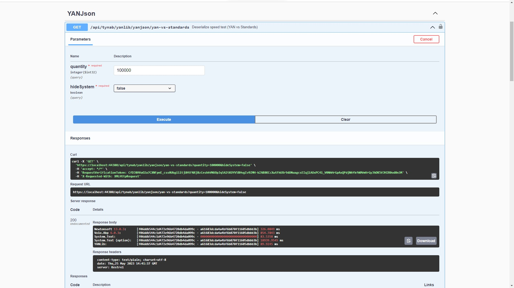

# YAMI AN NEPHILIM LIBRARY
YANLib is based on .NET 6.0 (LTS)

### INSTALL
https://www.nuget.org/packages/Tynab.YANLib
```
PM> NuGet\Install-Package Tynab.YANLib
```

### EXTENSION
- Bool
- Bytes
- DateTime
- Enum
- Enumerable
- JSON
- Numeric
- Text
- Object
- Nullable
- Process
- Random
- Task

[See wiki for more details](https://github.com/Tynab/YANLib/wiki)

## JSON
System.Text.Json is a default JSON library integrated in .NET Core and .NET Standard from version 3.0 onwards. It is used to convert .NET objects to JSON format and vice versa, supporting parsing and generating JSON strings.

Previously, in .NET Framework, Newtonsoft.Json was a popular JSON library used in .NET applications. However, with the introduction of System.Text.Json, .NET Core switched to using this library as the default choice.

System.Text.Json is designed to provide better performance and security compared to other JSON libraries. It supports advanced features like parallel parsing and support for new data types such as Span and Utf8JsonReader, enabling faster data processing and reduced memory usage.

Regarding performance, System.Text.Json, Newtonsoft.Json, and Volo.Json are all powerful JSON libraries in .NET, but their performance can vary depending on specific use cases.

However, based on performance benchmark tests conducted in different environments and scenarios, System.Text.Json is generally considered to have the best performance among these libraries. For example, according to performance tests, the results show that System.Text.Json has significantly faster JSON-to-.NET object and vice versa conversion times compared to Newtonsoft.Json, especially in cases with large data.

</img>

However, Volo.Json is also a fast and lightweight JSON library designed for optimizing performance and reliability. It is built on new .NET Core data types like Span, Utf8JsonReader, Utf8JsonWriter, which allows for faster data processing and reduced memory usage. In some cases, Volo.Json can provide better performance than System.Text.Json and Newtonsoft.Json.

<b>Case sensitivity when using System.Text.Json Deserialize/Serialize:</b>

When the properties of the object to be serialized to JSON have different capitalization, exceptions can occur when using JSON libraries.

To address this issue, we can use the optional properties of JSON libraries to customize the property naming in JSON as desired.

Here are some options for configuring performance when using JsonSerializerOptions:

1. Configure JsonSerializerOptions.PropertyNameCaseInsensitive to ensure that the Deserialize process can find properties regardless of their capitalization, not just according to the default case of System.Text.Json.
2. Use JsonSerializerOptions.IgnoreNullValues to exclude properties with null values during serialization, reducing the size of the generated data and increasing serialization speed.
3. Use JsonSerializerOptions.WriteIndented to configure the formatting of the serialized result with indentation for easier readability, but it also affects performance.
4. Use JsonSerializerOptions.MaxDepth to limit the maximum depth of the object being serialized or deserialized, preventing potential memory issues during serialization or deserialization.
5. Use JsonSerializerOptions.DictionaryKeyPolicy to configure the naming of keys in a Dictionary, helping to reduce the time for serialization and deserialization.

<i>Note:</i>
- When using the PropertyNameCaseInsensitive = true and PropertyNamingPolicy = CamelCase attributes in JsonSerializerOptions of System.Text.Json, the Serialize and Deserialize processes are configured to simultaneously support both capitalization styles and CamelCase in property names.
- However, using these options can affect the performance of the Serialize and Deserialize processes. When PropertyNameCaseInsensitive = true, System.Text.Json needs to search for properties in the object based on case-insensitive names, which adds processing time compared to the default case-sensitive search.
- To achieve both case-insensitive serialization and deserialization while maintaining application performance, the Tynab.YANLib package can be used.

## TEST

https://yanlib.yamiannephilim.com/api/yanlib/json/yan-vs-standards?quantity=10000&hideSystem=true

<p align='center'>
</img>
</p>

## CODE DEMO
```c#
var dto = json.Deserialize<JsonDto>();
```

### NOTE

- Elastic.Apm... (v.1.24.x and above) is spam logs.
- DotNetCap.CAP... (v.7.x.x and above) is MongoDB error.
- Do not [Remove Unused References...] in layers:
    - Host:
        - Microsoft.EntityFrameworkCore.Tools
        - DotNetCap.CAP...
        - Serilog...
        - Volo.Abp.EntityFrameworkCore.SqlServer
    - Domain.Shared:
        - Microsoft.Extensions.FileProviders.Embedded
